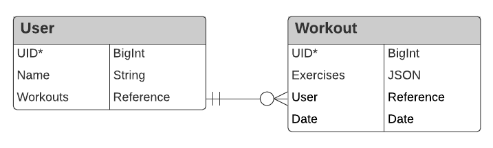
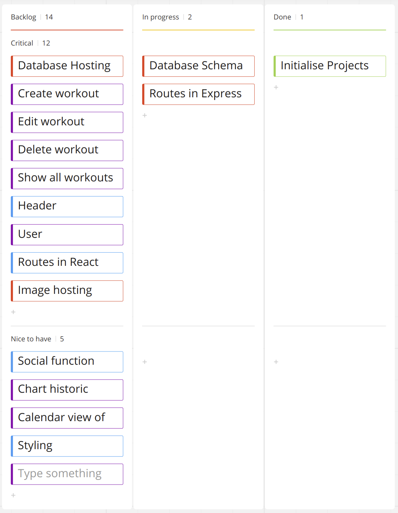
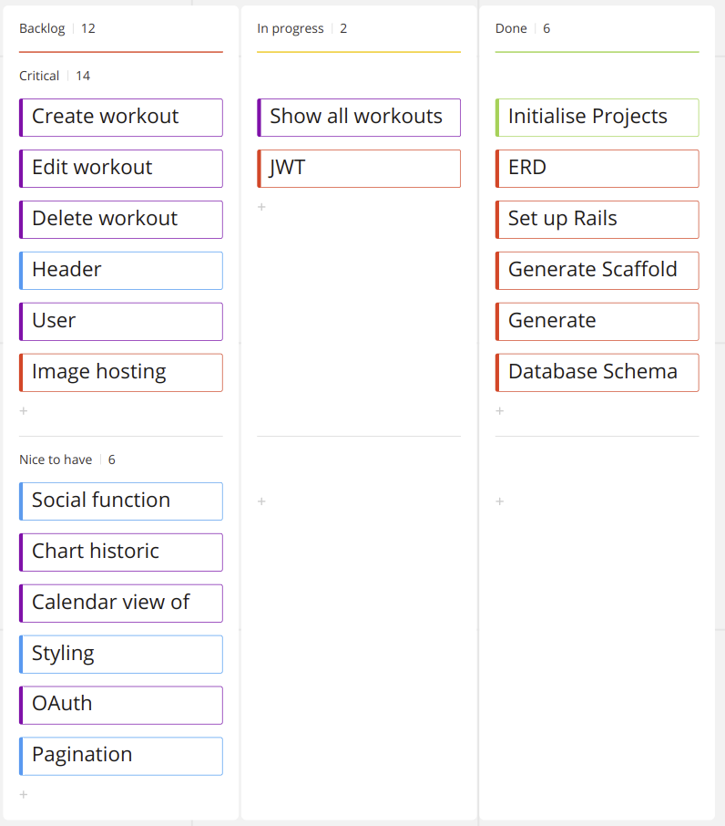
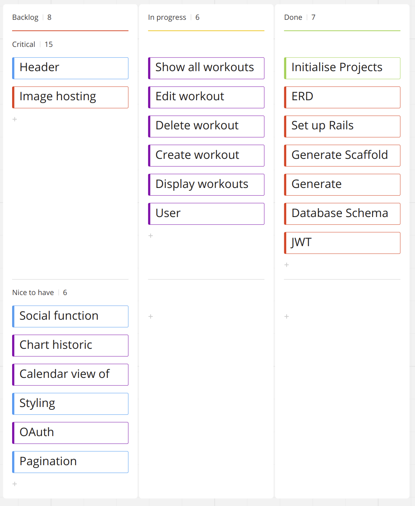
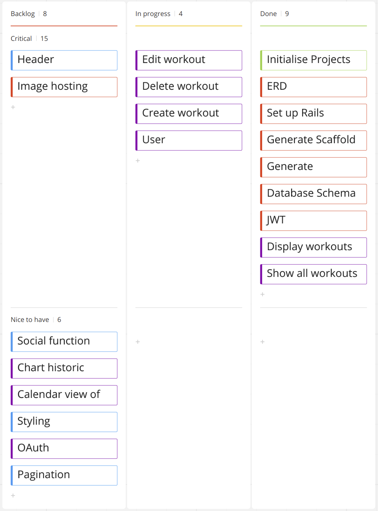
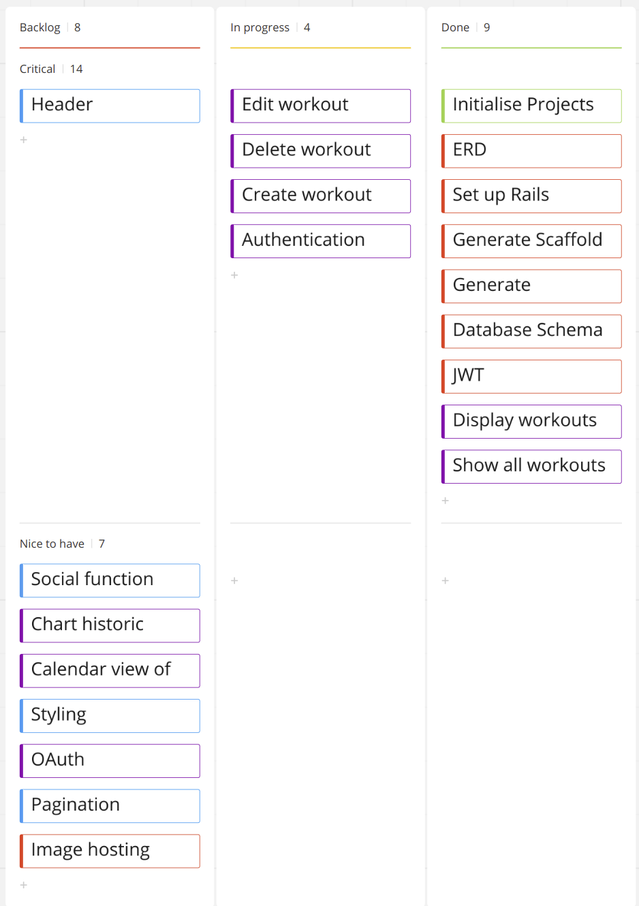

# fitr

Rails and React app built to track workouts. Built by Morgan Batterham and Gary Ho.

## Libraries used

## ERD

## Kanban Board Progress

#### End of Day 1

#### End of Day 2

#### End of Day 3

#### End of Day 4

#### End of Day 5

